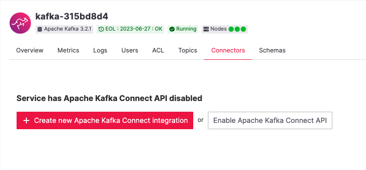
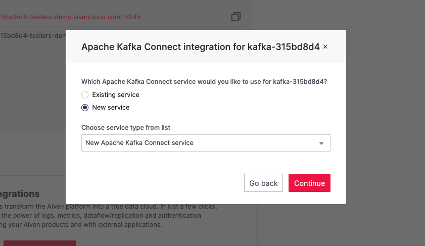
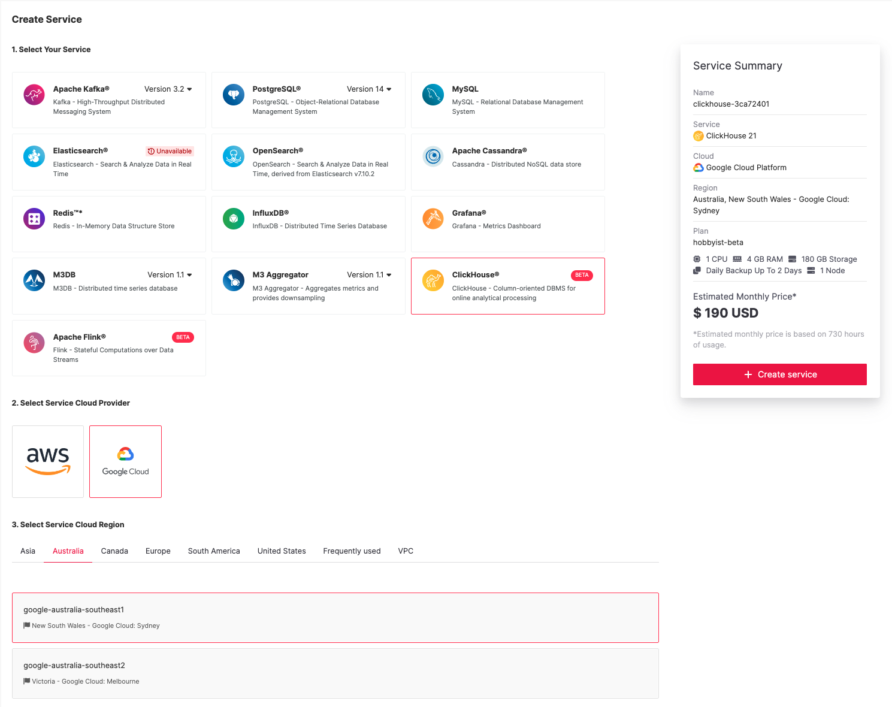
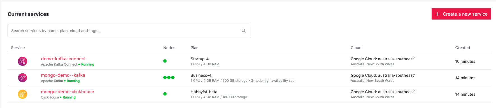
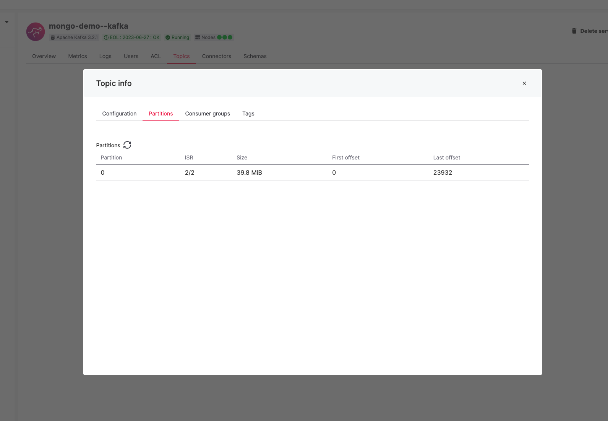
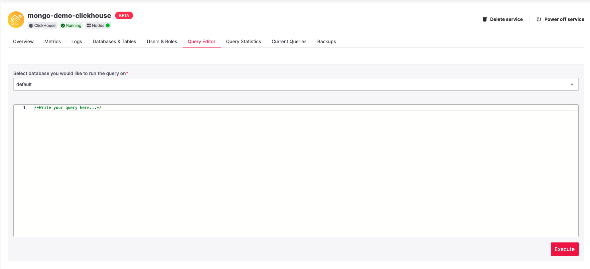
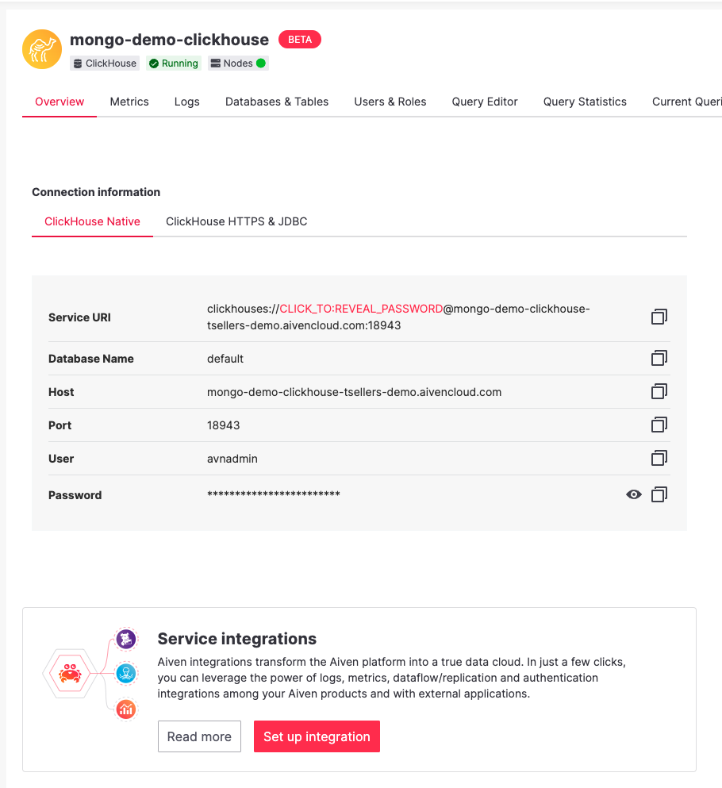
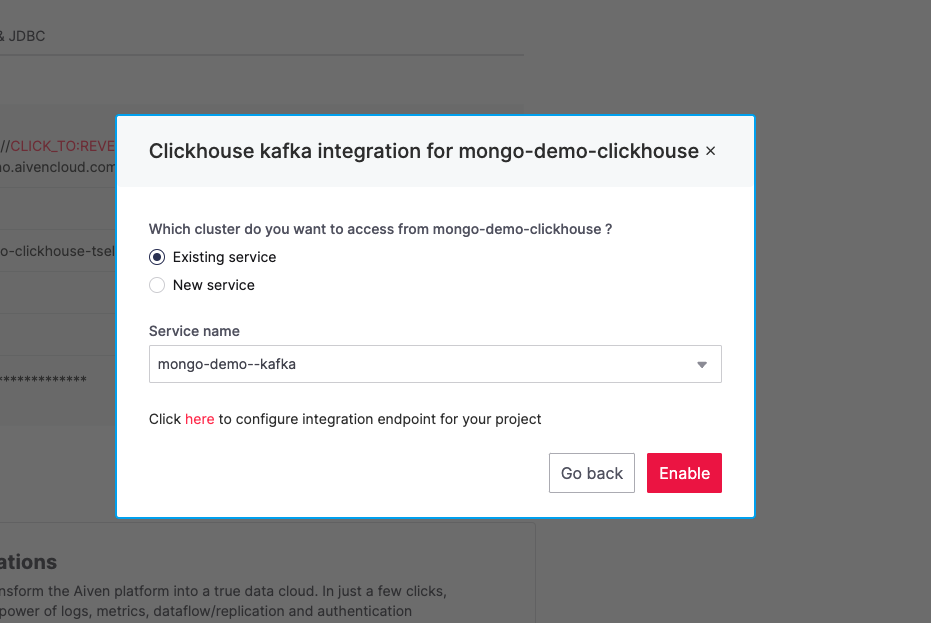
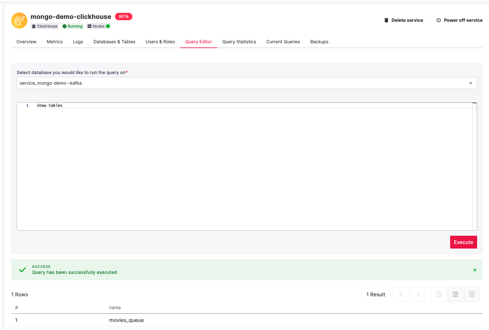
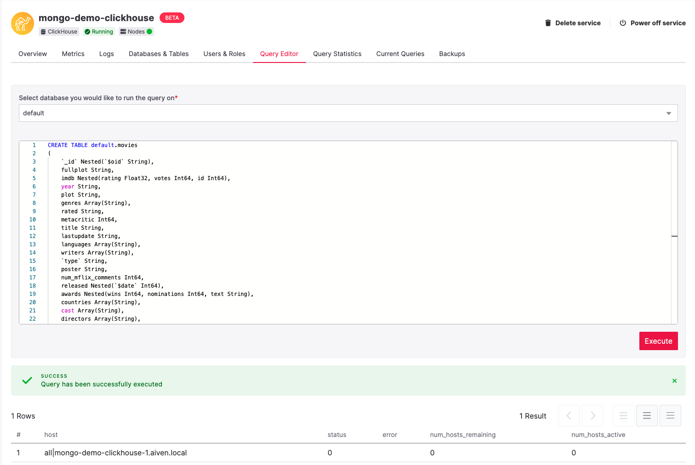

# Stream MongoDB Changes to Clickhouse

This project provides the resources necessary to setup a data stream of changes from the MongoDB sample dataset movies collection to an Aiven for Clickhouse service for analytics. 
Inspired by this handy blog post on [streaming IoT type data from Kafka to Clickhouse](https://aiven.io/blog/connecting-kafka-and-clickhouse)

When a user creates or updates a document in the source MongoDB service, this change will flow through a pipeline in Aiven and land in a Clickhouse table for analytics query. 

In effect, we are creating this 


## Setup the Sample Mongo Dataset
This example uses the trial version of the Mongo Atlas DB cloud service. [Sign Up](https://www.mongodb.com/cloud/atlas/efficiency) and load the sample datasets. 

Once you have loaded you should see the movies data when you browse the collections. It is the movies collection we will be using for this. 


# Create Aiven Resources
Now, let's create the resources that you will need for this project. 

Included in this repository is the terraform scripts you will need to create everything, so if you are familiar with [Terraform](https://registry.terraform.io/providers/aiven/aiven/latest/docs) and the [Aiven Terraform Provider](https://docs.aiven.io/docs/tools/terraform.html) please feel free to run these instead. 

At the moment, Aiven for Clickhouse is in a beta release which means there are a few things missing around the supporting tooling etc. 
If you are using Terraform, [these steps](#configure-clickhouse) are still required to finish.

Otherwise, if you would prefer to point and click let's get started in the console.

## Aiven for Apache Kafka

Open the [Aiven Console](https://console.aiven.io) and either login or sign up to create your trial. Trials are awesome as they give you $300 worth of free credits for just this type of exploration. 
Once you are logged in you should see the empty service panel, go ahead and create your Kafka service by clicking the "New Service" button at the top right. 


For this demo I have setup using a Business-4 plan in Google Cloud, Sydney Australia. As you are about to find out, changing this type of stuff with Aiven is super simple. 

Documentation for [Aiven for Apache Kafka](https://docs.aiven.io/docs/products/kafka.html)


## Aiven for Apache Kafka Connect
To setup Kafka Connect, we take a slightly different approach.  Open your newly created Kafka service by selecting it from the list of services and select the `Connectors` tab. 
From here you want to "Create new Apache Kafka Connect integration"



Once the modal opens, you want to create a New Service. I used a Startup-4 to keep the costs down!  



Once your Kafka Connect service is up and running, select it and go to the Connectors tab. 
Create a new connector using the [Mongo DB Source connector](https://docs.aiven.io/docs/products/kafka/kafka-connect/howto/mongodb-poll-source-connector.html). This is the [offical MongoDB connector](https://www.mongodb.com/docs/kafka-connector/current/source-connector/), if you wanted to you could accomplish this using the Debezium Source connector for MongoDB as well. 

The configuration required is 
```json
    "name" : "mongo-source",
    "connector.class" : "com.mongodb.kafka.connect.MongoSourceConnector",
    "connection.uri" :  "mongodb+srv://<mongo-user>:<mongo-pass>@<mongo-url>/?retryWrites=true&w=majority",
    "database" : "sample_mflix",
    "collection" : "movies",
    "copy.existing" : "true",
    "poll.await.time.ms" : "1000",
    "publish.full.document.only" : true,
    "poll.max.batch.size" : 500,
    "output.format.value":"json",
    "output.format.key":"json",
    "key.converter.schemas.enable":"false",
    "value.converter.schemas.enable":"false",
    "key.converter":"org.apache.kafka.connect.storage.StringConverter",
    "value.converter":"org.apache.kafka.connect.storage.StringConverter"
```

You can get the [connection string](https://www.mongodb.com/docs/guides/atlas/connection-string/) from MongoDB Atlas. 

Documentation for [Aiven for Apache Kafka Connect](https://docs.aiven.io/docs/products/kafka/kafka-connect.html)

## Aiven for Clickhouse
Lastly, setup you Clickhouse service by starting at the (you guessed it!) "New Service" button again. For my service I used the single core Hobbyist-Beta plan so we aren't going to be getting that awesome multi-core performance that Clickhouse is so well know for. I'm sure you will agree that even this service is incredible for what we are doing her. 

Interestingly enough here there is nothing stopping you from creating your services in different regions, or even in different clouds as Aiven will handle all the networking requirements for you. An added bonus of this feature is that the price of data ingress / egress is also included in the price that you see on the screen. There is no metered data charges involved.

If you just clicked past the note about [Beta Services at Aiven](https://docs.aiven.io/docs/platform/concepts/beta_services), it is probably worth while to jump into the documentation and understand what this means.



SURPRISE!! Extra credits for using the Beta Clickhouse service :) lucky you!

Documentation for [Aiven for Clickhouse](https://docs.aiven.io/docs/products/clickhouse.html)

You should have three services running, show all greens on the board! 


And after a minute or two you will see that the MongoDB source connector has created a topic for you and this topic has about 23000 messages in it.



# Configure Clickhouse

Let's setup the Clickhouse - Kafka integration and create the necessary tables. 

If you have used the terraform script, you will find a `clickhouse-setup.sh` has been created for you. Run this script to create a connection to Clickhouse from your terminal, it assumes you have the [Clickhouse client](https://clickhouse.com/docs/en/getting-started/install/) setup on your local machine though. 

If you wish to avoid that step you will find an incredibly handy query editor for Clickhouse right there in the Aiven console that we can use to achieve the rest of our tasks.



Firstly, the Clickhouse - Kafka integration needs to be setup. At the time of writing, this was not available in the terraform script so we will do this via the console. Open you Clickhouse service and hit the Setup Integrations button.



Select the Apache Kafka integration and select the existing service that you created earlier



Now we have to retrieve the Service Integration ID and for that we are going to need the Aiven CLI, you can install it following [these instructions](https://docs.aiven.io/docs/tools/cli.html)

You will know it is all successful when you can do this 
```console
$ avn
usage: avn [-h] [--config CONFIG] [--version] [--auth-ca FILE] [--auth-token AUTH_TOKEN] [--show-http] [--url URL] [--request-timeout REQUEST_TIMEOUT]  ...

optional arguments:
  -h, --help            show this help message and exit
  --config CONFIG       config file location '/Users/troysellers/.config/aiven/aiven-client.json'
  --version             show program's version number and exit
  --auth-ca FILE        CA certificate to use [AIVEN_CA_CERT], default None
  --auth-token AUTH_TOKEN
                        Client auth token to use [AIVEN_AUTH_TOKEN], [AIVEN_CREDENTIALS_FILE]
  --show-http           Show HTTP requests and responses
  --url URL             Server base url default 'https://api.aiven.io'
  --request-timeout REQUEST_TIMEOUT
                        Wait for up to N seconds for a response to a request (default: infinite)

command categories:
  
    account             Account commands
    billing-group       Billing-Group commands
    card                Card commands
    cloud               Cloud commands
    crab                Aiven crab
    credits             Credits commands
    events              View project event logs
    help                List commands
    mirrormaker         Mirrormaker commands
    project             Project commands
    service             Service commands
    static-ip           Static-Ip commands
    ticket              Ticket commands
    user                User commands
    vpc                 Vpc commands
``` 

Once it's working, find your service integration identifier 

```console
avn service integration-list mongo-demo-clickhouse
SERVICE_INTEGRATION_ID                SOURCE                 DEST                   INTEGRATION_TYPE  ENABLED  ACTIVE  DESCRIPTION                                                                     
====================================  =====================  =====================  ================  =======  ======  ================================================================================
f39046a3-<redacted>-529b6e0a0edd  mongo-demo--kafka      mongo-demo-clickhouse  clickhouse_kafka  true     true    Access a Kafka cluster from ClickHouse
(integration not enabled)             mongo-demo-clickhouse  mongo-demo--kafka      kafka_logs        false    false   Send service logs to Aiven Apache Kafka service or external Apache Kafka cluster
```

Now let's create the data table that is going to be used to connect Clickhouse to Kafka by using the following command in your Terminal. (Update the two variables at the top of the command to match the environment you have created first)
```console 
avn service integration-update <SERVICE_INTEGRATION_ID> \
    --project <YOUR PROJECT NAME> \
    --user-config-json '{
    "tables": [
        {
            "name": "movies_queue2",
            "columns": [
                {"name": "_id" , "type": "Nested(`$oid` String)"},
                {"name": "fullplot" , "type": "String"},
                {"name": "imdb" , "type": "Nested( rating Float32, votes Int64, id Int64)"},
                {"name": "year" , "type": "String"},
                {"name": "plot" , "type": "String"},
                {"name": "genres" , "type": "Array(String)"},
                {"name": "rated" , "type": "String"},
                {"name": "metacritic" , "type": "Int64"},
                {"name": "title" , "type": "String"},
                {"name": "lastupdate" , "type": "String"},
                {"name": "languages" , "type": "Array(String)"},
                {"name": "writers" , "type": "Array(String)"},
                {"name": "type" , "type": "String"},
                {"name" : "poster" , "type": "String"},
                {"name": "num_mflix_comments" , "type": "Int64"},
                {"name": "released" , "type": "Nested(`$date` Int64)"},
                {"name": "awards" , "type": "Nested(wins Int64, nominations Int64, text String)"},
                {"name": "countries" , "type": "Array(String)"},
                {"name": "cast" , "type": "Array(String)"},
                {"name": "directors" , "type": "Array(String)"},
                {"name": "runtime" , "type": "Int64"}
            ],
            "topics": [{"name": "sample_mflix.movies"}],
            "data_format": "JSONEachRow",
            "group_name": "movies_consumer"
        }
    ]
}'
```

Once that has executed you should be able to see a table in the database created by the integration in the console query editor. Be sure to select the right database here, the integration table is not created in the default database. 



Now, let's create the user query table and the materialised view. First, the table... 

```sql
CREATE TABLE default.movies
(
    `_id` Nested(`$oid` String),
    fullplot String,
    imdb Nested(rating Float32, votes Int64, id Int64),
    year String,
    plot String,
    genres Array(String),
    rated String,
    metacritic Int64,
    title String,
    lastupdate String,
    languages Array(String),
    writers Array(String),
    `type` String,
    poster String,
    num_mflix_comments Int64,
    released Nested(`$date` Int64),
    awards Nested(wins Int64, nominations Int64, text String),
    countries Array(String),
    cast Array(String),
    directors Array(String),
    runtime Int64
) ENGINE = MergeTree ORDER BY (`_id.$oid`);
```
Then the materialised view

```sql
CREATE MATERIALIZED VIEW default.movies_mv TO default.movies AS 
SELECT *
FROM `service_mongo-demo--kafka`.movies_queue;
```

Successful create will look something like 



Now you should be able to select data from your movies table. Happy analytic'ing :) 